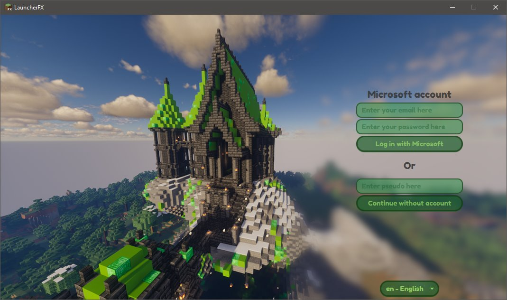
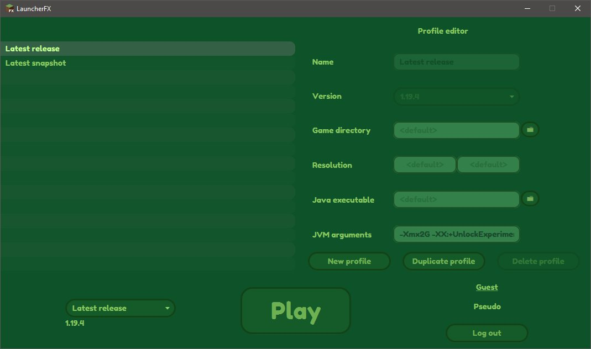

# LauncherFX
 A Minecraft: Java Edition launcher made with Java 8 and JavaFX.

### Features
* Launch almost all Minecraft versions
* Customize configurations (game dir, java exe, java args)
* Microsoft account logging
* Play without account
* Multi-account support

## Screenshots

### Logging page

### Main page

